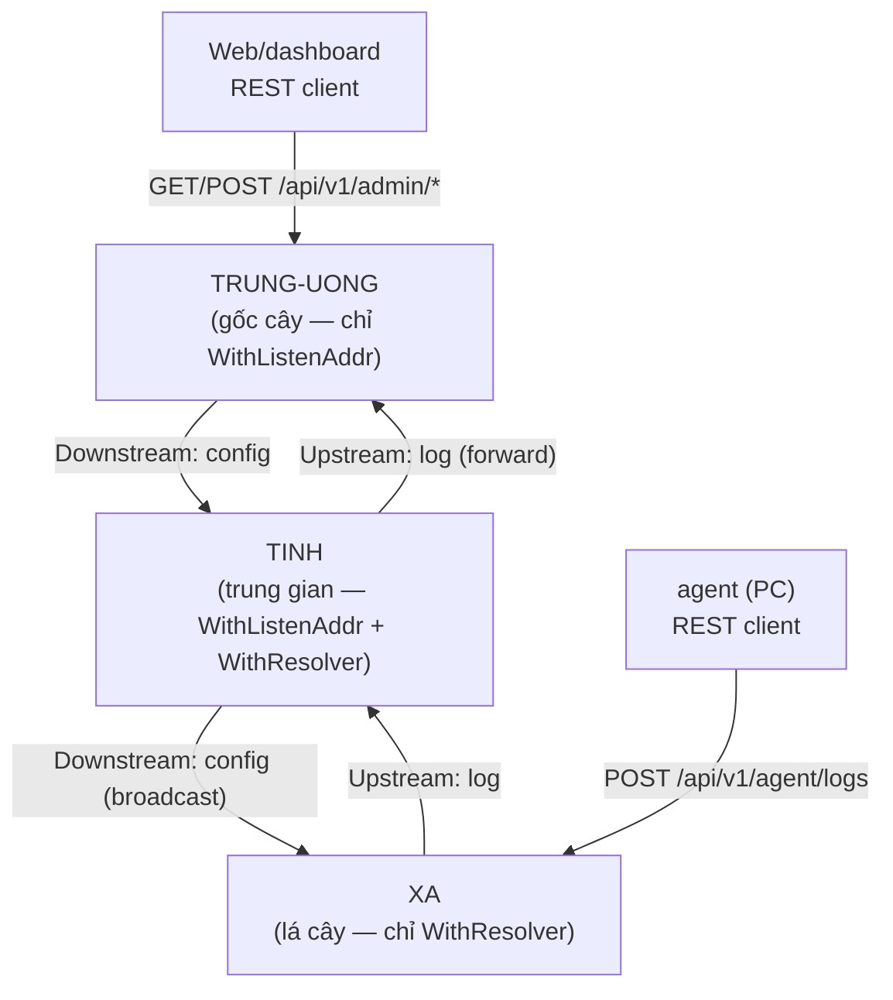
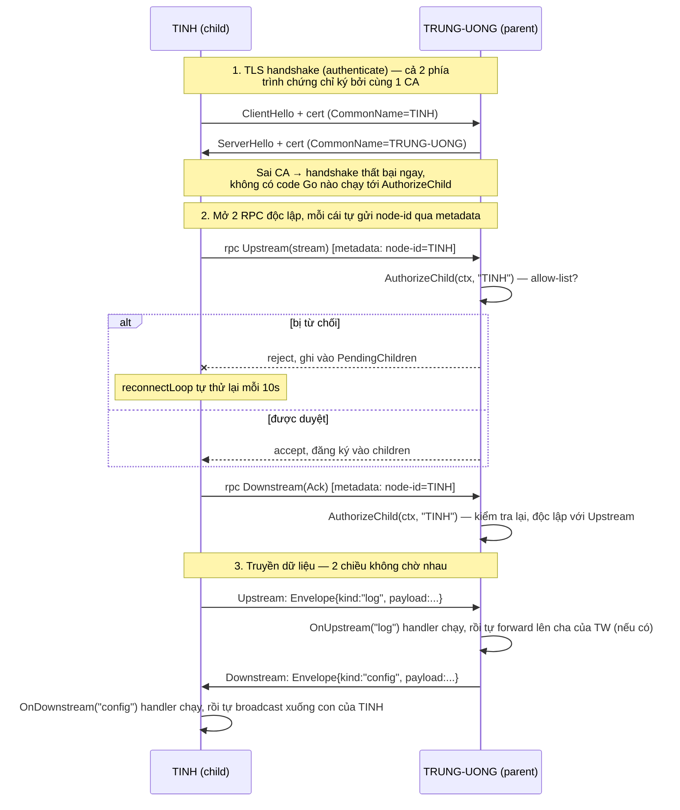

# multi-region

Framework Go cho hệ thống phân cấp cha-con: một `node.Node` có thể vừa là
**Trung tâm** (gốc cây), vừa là **Chi nhánh** (vừa nhận từ con, vừa gửi lên
cấp trên), tùy vào cách bạn cấu hình — không có khái niệm "role" cố định,
khả năng của node hoàn toàn do các option được truyền vào quyết định.

Framework **chỉ lo cơ chế**: thiết lập/giữ/tự nối lại kết nối giữa cha và
con, và truyền dữ liệu đáng tin cậy theo cả 2 chiều. Framework **không biết
"log" hay "config" là gì** — đó là khái niệm do service dùng framework tự
định nghĩa (xem "Ý tưởng cốt lõi" bên dưới).

> Muốn chạy thử ngay (3 node mẫu, mTLS, dashboard) thay vì đọc lý thuyết
> trước? Xem **[examples/README.md](examples/README.md)**.

## Mục lục

- [Ý tưởng cốt lõi](#ý-tưởng-cốt-lõi)
- [Mô hình luồng hoạt động](#mô-hình-luồng-hoạt-động)
- [Cấu trúc package](#cấu-trúc-package)
- [Dùng như thư viện Go trong code của bạn](#dùng-như-thư-viện-go-trong-code-của-bạn)
- [Phê duyệt con kết nối](#phê-duyệt-con-kết-nối)
- [Gửi thông số riêng cho 1 con](#gửi-thông-số-riêng-cho-1-con)
- [Metrics (Prometheus)](#metrics-prometheus)
- [Chạy test](#chạy-test)
- [Sinh lại code từ proto](#sinh-lại-code-từ-proto)

## Ý tưởng cốt lõi

Một `Node` có 2 khả năng độc lập, bật/tắt bằng option khi khởi tạo:

| Option đã set | Node lắng nghe con? | Node nối lên cha? | Vai trò tương ứng |
|---|---|---|---|
| chỉ `WithListenAddr` | Có | Không | **Trung tâm** (gốc cây) |
| chỉ `WithResolver` | Không | Có | **Leaf** (lá cây, không có con) |
| cả hai | Có | Có | **Chi nhánh** (node trung gian) |

Node **không tự biết** nó là "root/branch/leaf" — đó không phải khái niệm
trong code. `id` (qua `WithID`) chỉ là 1 cái tên bạn tự đặt (dùng để định
danh + để cha duyệt con); vai trò thực tế chỉ do 2 option ở trên quyết
định.

**Đơn vị dữ liệu duy nhất mà framework di chuyển là `Envelope`**
(`proto.Envelope`): gồm `id`, `kind` (chuỗi tự do), `payload` (bytes),
`timestamp`. Framework không hiểu `kind`/`payload` nghĩa là gì — service
tự định nghĩa (ví dụ `kind = "log"` hay `kind = "config"`) và tự đăng ký
handler xử lý theo `kind` đó.

Luồng dữ liệu:

- **Upstream (con → cha)**: gọi `node.SendUp(ctx, kind, payload)` (dữ liệu
  sinh ra tại chỗ) hoặc khi 1 con gửi lên qua kết nối gRPC. Node chạy các
  handler đã đăng ký qua `OnUpstream(kind, ...)`, rồi **tự động forward
  tiếp lên cha** (nếu có) — lặp lại đệ quy tới khi tới node gốc.
- **Downstream (cha → con)**: gọi `node.SendDown(ctx, kind, payload)` để
  đẩy xuống **mọi** con đang kết nối (broadcast), hoặc
  `node.SendToChild(childID, kind, payload)` để gửi **đích danh 1 con cụ
  thể** (xem [Gửi thông số riêng cho 1 con](#gửi-thông-số-riêng-cho-1-con)).
- **Chịu lỗi**: nếu mất kết nối lên cha, Envelope upstream gửi thất bại
  được giữ tạm trong 1 hàng đợi **trong bộ nhớ** (không phải file/DB); một
  vòng lặp nền định kỳ thử gửi lại, và kết nối gRPC tự mở lại khi cha
  online trở lại. Nếu tiến trình bị dừng trước khi gửi thành công, dữ
  liệu trong hàng đợi đó **sẽ mất** — muốn dữ liệu sống sót qua restart,
  service phải tự lưu trước khi gọi `SendUp`.
- **Phê duyệt con kết nối**: cha có thể cài hook `WithAuthorizeChild(...)`
  để chấp nhận/từ chối 1 con ngay khi nó cố kết nối, dựa trên `node-id` nó
  tự khai báo (xem [Phê duyệt con kết nối](#phê-duyệt-con-kết-nối)).
- **Upstream và downstream chạy trên 2 kết nối gRPC hoàn toàn độc lập**
  (`NodeService.Upstream` — client-streaming, `NodeService.Downstream` —
  server-streaming), không phải chung 1 bidirectional stream. Mục đích:
  nếu 1 chiều bị nghẽn (mạng chậm, cha xử lý chậm), chiều còn lại vẫn tiếp
  tục bình thường — con vẫn gửi log lên được dù đang chờ 1 config lớn tải
  xuống, và ngược lại. Đánh đổi: mỗi con cần 2 kết nối TCP/HTTP2 tới cha
  thay vì 1.

## Mô hình luồng hoạt động

Ví dụ cây 3 tầng: TRUNG-UONG (gốc) → TINH (trung gian) → XA (lá):



Mỗi cạnh cha-con trong sơ đồ trên thực chất là **2 kết nối gRPC độc lập**
(xem [Ý tưởng cốt lõi](#ý-tưởng-cốt-lõi)) — không phải 1 đường duy nhất.
Chi tiết từng bước khi TINH khởi động và kết nối lên TRUNG-UONG:



Vài điểm mấu chốt rút ra từ sơ đồ trên:

- **CA xác thực (authenticate), CommonName định danh (identify)** — 2 việc
  khác nhau, xảy ra ở 2 bước khác nhau. Cert ký sai CA bị chặn *trước khi*
  `AuthorizeChild` chạy; cert đúng CA nhưng `node-id` không nằm trong
  allow-list mới bị `AuthorizeChild` từ chối ở bước sau.
- **Upstream và Downstream là 2 RPC tách biệt**, mỗi cái tự
  `AuthorizeChild` riêng, tự sống/chết độc lập — mất Downstream không ảnh
  hưởng khả năng gửi Upstream, và ngược lại.
- **Framework chỉ làm tới bước 3** (di chuyển Envelope) — nó không biết
  `"log"` hay `"config"` nghĩa là gì, không tự lưu trữ, không tự tổng hợp.
  Mọi xử lý nội dung là việc của handler `OnUpstream`/`OnDownstream` mà
  service tự đăng ký.

## Cấu trúc package

```
multi-region/
├── node/          # core framework: Node, Option, Start/Stop,
│                  #   SendUp/SendDown/SendToChild, OnUpstream/OnDownstream
├── transport/     # gRPC server + client (mTLS): 2 RPC độc lập
│                  #   (Upstream client-streaming, Downstream server-
│                  #   streaming), theo dõi con bằng node-id, AuthorizeChild
├── proto/         # định nghĩa protobuf: Envelope, Ack, NodeService
├── resolver/       # tìm địa chỉ cha (mặc định: static config)
├── auth/           # mTLS Authenticator + helper sinh cert test
├── metrics/        # số liệu Prometheus về cơ chế vận chuyển (không phải
│                   #   nội dung log/config) — service tự mount Handler()
└── examples/       # binary ví dụ minh họa dùng framework — xem
                    #   examples/README.md
```

Lưu ý: framework core (`node`, `transport`, `proto`, `resolver`, `auth`,
`metrics`) **không có package storage nào** — việc lưu trữ dữ liệu là lựa
chọn của từng service dùng framework, không phải framework.

## Dùng như thư viện Go trong code của bạn

```go
import (
    "context"

    "github.com/anbebong/multi-region/auth"
    "github.com/anbebong/multi-region/node"
    "github.com/anbebong/multi-region/proto"
    "github.com/anbebong/multi-region/resolver"
)

func main() {
    authn, _ := auth.NewMTLSAuthenticator("ca.pem", "branch-1.pem", "branch-1.key")

    n, err := node.New(
        node.WithID("branch-1"),
        node.WithListenAddr(":9443"),                              // có con
        node.WithResolver(resolver.NewStaticResolver("root:9443")), // có cha
        node.WithAuthenticator(authn),
    )
    if err != nil {
        panic(err)
    }

    // Tự định nghĩa và xử lý kind riêng của service — framework không
    // biết "log" là gì, chỉ biết gọi lại handler này khi có Envelope
    // kind="log" tới (từ con, hoặc do chính node này SendUp).
    n.OnUpstream("log", func(ctx context.Context, env *proto.Envelope) {
        // TODO: service tự lưu env vào storage riêng của mình nếu cần.
    })

    ctx := context.Background()
    if err := n.Start(ctx); err != nil {
        panic(err)
    }
    defer n.Stop()

    n.SendUp(ctx, "log", []byte("hello"))
}
```

Package `auth` cung cấp `auth.GenerateTestCA(t)` để sinh CA + cert test
nhanh trong unit test (xem `auth/testutil.go`) — chỉ dùng cho test, không
dùng cho production. Khi triển khai thật, sinh CA/cert bằng công cụ PKI
nội bộ của bạn (Vault, cfssl, openssl...), hoặc dùng `examples/gencert`
làm tham khảo cách tạo cert tự ký cho việc thử nghiệm.

Muốn xem 1 chương trình hoàn chỉnh dùng toàn bộ API dưới đây (REST API,
dashboard, storage, allow-list, metrics) — xem
**[examples/README.md](examples/README.md)** và
`examples/node/main.go`.

## Phê duyệt con kết nối

Mặc định, framework chấp nhận **bất kỳ con nào** có mTLS handshake hợp lệ
(cert ký bởi cùng CA) — không có bước duyệt riêng. Để giới hạn cụ thể con
nào được phép kết nối, dùng `node.WithAuthorizeChild(...)`:

```go
n, err := node.New(
    node.WithID("root"),
    node.WithListenAddr(":9443"),
    node.WithAuthenticator(authn),
    node.WithAuthorizeChild(func(ctx context.Context, nodeID string) error {
        if nodeID != "branch-1" {
            return fmt.Errorf("node-id %q không được phép", nodeID)
        }
        return nil
    }),
)
```

- Con tự gửi `node-id` của nó (chính là giá trị `WithID(...)` của con) qua
  gRPC metadata ngay khi mở kết nối — không cần sửa `proto/node.proto`.
- Hook chạy **trước khi** con được đăng ký vào cây; trả lỗi = từ chối kết
  nối ngay lập tức.
- Framework chỉ cung cấp hook và thời điểm gọi nó — **không có ý kiến gì
  về nghĩa của "được phép"**. Chính sách cụ thể là việc của service.
- Nếu bị từ chối, con **không bỏ cuộc** — `transport.Client` tự động thử
  kết nối lại mỗi vài giây (giống hệt cơ chế phục hồi sau mất mạng), nên
  ngay khi admin duyệt, con tự vào được mà **không cần restart tiến trình
  con**.
- Framework tự ghi nhớ (trong bộ nhớ) `node-id` nào **vừa bị từ chối lần
  đầu** — qua `Node.PendingChildren()` — để admin biết "ai đang gõ cửa xin
  vào" thay vì phải tự đoán trước tên con sắp kết nối. Chỉ ghi lần từ chối
  đầu tiên (không cập nhật lại mỗi lần con retry); mục biến mất ngay khi
  `node-id` đó được duyệt và kết nối thành công.

Xem `examples/node/allowlist.go` để tham khảo 1 chính sách cụ thể (đối
chiếu allow-list + xác nhận khớp CommonName trên chứng chỉ mTLS).

## Gửi thông số riêng cho 1 con

`SendDown` gửi (broadcast) cho **mọi** con đang kết nối. Để gửi dữ liệu chỉ
cho **đúng 1 con cụ thể**, dùng `SendToChild`:

```go
err := n.SendToChild("branch-1", "config", []byte(`{"threshold": 42}`))
```

- `childID` là `node-id` con đã tự khai báo lúc kết nối (giống với dùng ở
  `AuthorizeChild`).
- Trả lỗi nếu không có con nào với `node-id` đó đang kết nối — khác với
  `SendDown`, vốn coi việc không có con nào cũng là bình thường (no-op).
- Framework chỉ định tuyến đúng Envelope tới đúng con — **không lưu, không
  biết** nội dung "thông số" đó là gì. Việc ghi nhớ cấu hình riêng của
  từng con (khi nó offline, để gửi lại sau...) là việc của service.

## Metrics (Prometheus)

Framework core tự đo và expose số liệu về **cơ chế vận chuyển của chính
nó** — không phải về nội dung `log`/`config` mà service tự định nghĩa:

| Metric | Loại | Nhãn | Ý nghĩa |
|---|---|---|---|
| `multiregion_envelopes_sent_total` | Counter | `direction` | Envelope gửi thành công |
| `multiregion_envelopes_received_total` | Counter | `direction` | Envelope nhận được |
| `multiregion_envelopes_dropped_total` | Counter | `direction`, `reason` | Envelope bị rớt (vd buffer downstream đầy) |
| `multiregion_child_connections` | Gauge | `rpc` (`upstream`/`downstream`) | Số con đang kết nối ngay lúc này |
| `multiregion_child_rejections_total` | Counter | — | Số lần `AuthorizeChild` từ chối kết nối |
| `multiregion_forward_latency_seconds` | Histogram | `outcome` (`success`/`failure`) | Độ trễ forward 1 Envelope lên cha |

Package `metrics` (`metrics/metrics.go`) tự đăng ký các metric này vào
registry Prometheus mặc định (`promauto`), và `transport.Server`/
`transport.Client` tự tăng chúng tại đúng điểm sự kiện (connect, reject,
gửi, nhận, drop, forward). **Framework không tự mở HTTP server nào** — dùng
`metrics.Handler()` (trả về `http.Handler` chuẩn) và tự mount vào server
sẵn có của bạn, ví dụ:

```go
mux.Handle("GET /metrics", metrics.Handler())
```

## Chạy test

```bash
go test ./...            # toàn bộ unit test + integration test
go test ./node/... -v    # riêng test tích hợp nhiều node (3 tầng, resilience, phê duyệt, SendToChild)
```

Test tích hợp trong `node/integration_test.go` và `node/resilience_test.go`
dựng thật nhiều node qua TCP `127.0.0.1` (không mock), bao gồm: upstream
đệ quy nhiều tầng, downstream đệ quy nhiều tầng, mất kết nối cha rồi phục
hồi, gửi đích danh 1 con (`SendToChild`), và từ chối con không được phép
(`AuthorizeChild`).

## Sinh lại code từ proto

Nếu bạn sửa `proto/node.proto`, cần cài `protoc` + 2 plugin rồi generate
lại:

```bash
go install google.golang.org/protobuf/cmd/protoc-gen-go@latest
go install google.golang.org/grpc/cmd/protoc-gen-go-grpc@latest
make proto
```

---

See `docs/superpowers/specs/2026-07-17-hierarchical-node-framework-design.md`
for kiến trúc/thiết kế gốc (lưu ý: tài liệu đó mô tả thiết kế ban đầu dựa
trên `LogEntry`/`ConfigPayload` cứng — đã được thay bằng `Envelope` trừu
tượng, xem phần "Ý tưởng cốt lõi" ở trên để biết thiết kế hiện tại).
