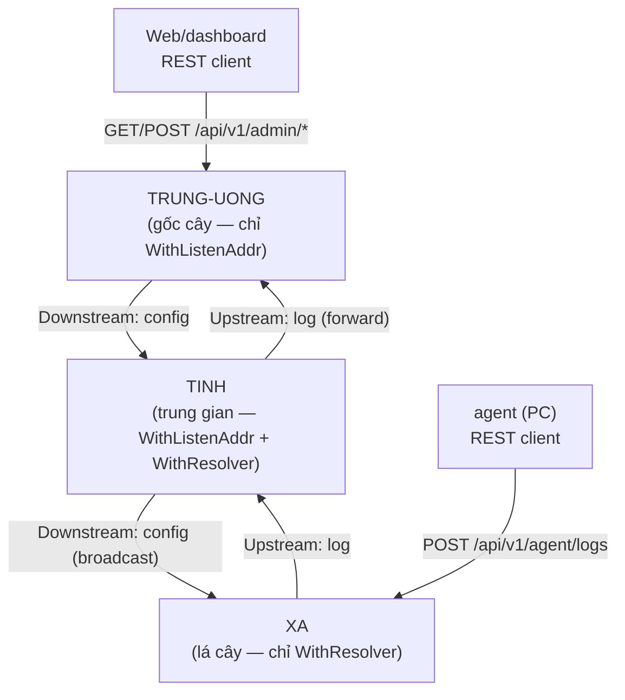
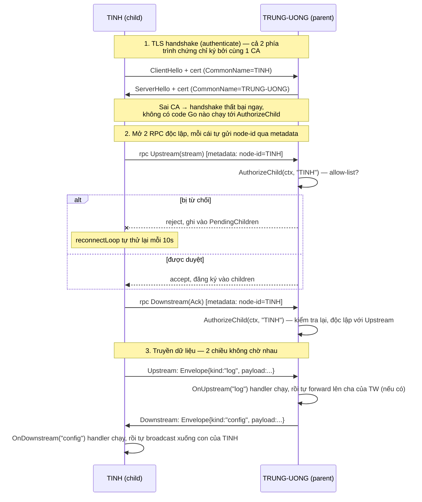

# multi-region

Framework Go cho hệ thống phân cấp cha-con: một `node.Node` có thể vừa là
**Trung tâm** (gốc cây), vừa là **Chi nhánh** (vừa nhận từ con, vừa gửi lên
cấp trên), tùy vào cách bạn cấu hình — không có khái niệm "role" cố định,
khả năng của node hoàn toàn do các option được truyền vào quyết định.

Framework **chỉ lo cơ chế**: thiết lập/giữ/tự nối lại kết nối giữa cha và
con, và truyền dữ liệu đáng tin cậy theo cả 2 chiều. Framework **không biết
"log" hay "config" là gì** — đó là khái niệm do service dùng framework tự
định nghĩa (xem "Ý tưởng cốt lõi" bên dưới).

## Mục lục

- [Ý tưởng cốt lõi](#ý-tưởng-cốt-lõi)
- [Mô hình luồng hoạt động](#mô-hình-luồng-hoạt-động)
- [Cấu trúc package](#cấu-trúc-package)
- [Chạy thử nhanh (3 node, mTLS, phê duyệt)](#chạy-thử-nhanh-3-node-mtls-phê-duyệt)
- [Tham chiếu file config JSON](#tham-chiếu-file-config-json)
- [Phê duyệt con kết nối](#phê-duyệt-con-kết-nối)
- [Gửi thông số riêng cho 1 con](#gửi-thông-số-riêng-cho-1-con)
- [Dùng như thư viện Go trong code của bạn](#dùng-như-thư-viện-go-trong-code-của-bạn)
- [Chạy test](#chạy-test)
- [Sinh lại code từ proto](#sinh-lại-code-từ-proto)
- [Xử lý sự cố](#xử-lý-sự-cố)

## Ý tưởng cốt lõi

Một `Node` có 2 khả năng độc lập, bật/tắt bằng option khi khởi tạo:

| Option đã set | Node lắng nghe con? | Node nối lên cha? | Vai trò tương ứng |
|---|---|---|---|
| chỉ `WithListenAddr` | Có | Không | **Trung tâm** (gốc cây) |
| chỉ `WithResolver` | Không | Có | **Leaf** (lá cây, không có con) |
| cả hai | Có | Có | **Chi nhánh** (node trung gian) |

Node **không tự biết** nó là "root/branch/leaf" — đó không phải khái niệm
trong code. `id` trong config chỉ là 1 cái tên bạn tự đặt (dùng để định
danh + để cha duyệt con); vai trò thực tế chỉ do 2 option ở trên quyết
định.

**Đơn vị dữ liệu duy nhất mà framework di chuyển là `Envelope`**
(`proto.Envelope`): gồm `id`, `kind` (chuỗi tự do), `payload` (bytes),
`timestamp`. Framework không hiểu `kind`/`payload` nghĩa là gì — service
tự định nghĩa (ví dụ `kind = "log"` hay `kind = "config"`) và tự đăng ký
handler xử lý theo `kind` đó.

Luồng dữ liệu:

- **Upstream (con → cha)**: gọi `node.SendUp(ctx, kind, payload)` (dữ liệu
  sinh ra tại chỗ, ví dụ agent gửi vào) hoặc khi 1 con gửi lên qua kết nối
  gRPC. Node chạy các handler đã đăng ký qua `OnUpstream(kind, ...)`, rồi
  **tự động forward tiếp lên cha** (nếu có) — lặp lại đệ quy tới khi tới
  node gốc.
- **Downstream (cha → con)**: gọi `node.SendDown(ctx, kind, payload)` để
  đẩy xuống **mọi** con đang kết nối (broadcast), hoặc
  `node.SendToChild(childID, kind, payload)` để gửi **đích danh 1 con cụ
  thể** (xem [Gửi thông số riêng cho 1 con](#gửi-thông-số-riêng-cho-1-con)).
- **Chịu lỗi**: nếu mất kết nối lên cha, Envelope upstream gửi thất bại
  được giữ tạm trong 1 hàng đợi **trong bộ nhớ** (không phải file/DB); một
  vòng lặp nền định kỳ thử gửi lại, và kết nối gRPC tự mở lại khi cha
  online trở lại. Nếu tiến trình bị dừng trước khi gửi thành công, dữ
  liệu trong hàng đợi đó **sẽ mất** — muốn dữ liệu sống sót qua restart,
  service phải tự lưu trước khi gọi `SendUp` (xem `examples/node`).
- **Phê duyệt con kết nối**: cha có thể cài hook `WithAuthorizeChild(...)`
  để chấp nhận/từ chối 1 con ngay khi nó cố kết nối, dựa trên `node-id` nó
  tự khai báo (xem [Phê duyệt con kết nối](#phê-duyệt-con-kết-nối)).
- **Upstream và downstream chạy trên 2 kết nối gRPC hoàn toàn độc lập**
  (`NodeService.Upstream` — client-streaming, `NodeService.Downstream` —
  server-streaming), không phải chung 1 bidirectional stream. Mục đích:
  nếu 1 chiều bị nghẽn (mạng chậm, cha xử lý chậm), chiều còn lại vẫn tiếp
  tục bình thường — con vẫn gửi log lên được dù đang chờ 1 config lớn tải
  xuống, và ngược lại. Đánh đổi: mỗi con cần 2 kết nối TCP/HTTP2 tới cha
  thay vì 1.

## Mô hình luồng hoạt động

Cây ví dụ 3 tầng dùng xuyên suốt tài liệu này (TRUNG-UONG → TINH → XA — xem
[Chạy thử nhanh](#chạy-thử-nhanh-3-node-mtls-phê-duyệt)):



Mỗi cạnh cha-con trong sơ đồ trên thực chất là **2 kết nối gRPC độc lập**
(xem [Ý tưởng cốt lõi](#ý-tưởng-cốt-lõi)) — không phải 1 đường duy nhất.
Chi tiết từng bước khi TINH khởi động và kết nối lên TRUNG-UONG:



Vài điểm mấu chốt rút ra từ sơ đồ trên:

- **CA xác thực (authenticate), CommonName định danh (identify)** — 2 việc
  khác nhau, xảy ra ở 2 bước khác nhau. Cert ký sai CA bị chặn *trước khi*
  `AuthorizeChild` chạy; cert đúng CA nhưng `node-id` không nằm trong
  allow-list mới bị `AuthorizeChild` từ chối ở bước sau.
- **Upstream và Downstream là 2 RPC tách biệt**, mỗi cái tự
  `AuthorizeChild` riêng, tự sống/chết độc lập — mất Downstream không ảnh
  hưởng khả năng gửi Upstream, và ngược lại.
- **Framework chỉ làm tới bước 3** (di chuyển Envelope) — nó không biết
  `"log"` hay `"config"` nghĩa là gì, không tự lưu trữ, không tự tổng hợp.
  Mọi xử lý nội dung là việc của handler `OnUpstream`/`OnDownstream` mà
  service tự đăng ký (xem `examples/node/main.go`).

## Cấu trúc package

```
multi-region/
├── node/          # core framework: Node, Option, Start/Stop,
│                  #   SendUp/SendDown/SendToChild, OnUpstream/OnDownstream
├── transport/     # gRPC server + client (mTLS): 2 RPC độc lập
│                  #   (Upstream client-streaming, Downstream server-
│                  #   streaming), theo dõi con bằng node-id, AuthorizeChild
├── proto/         # định nghĩa protobuf: Envelope, Ack, NodeService
├── resolver/       # tìm địa chỉ cha (mặc định: static config)
├── auth/           # mTLS Authenticator + helper sinh cert test
└── examples/
    ├── node/       # binary ví dụ: 1 service dùng framework, tự định
    │               #   nghĩa "log"/"config", tự lưu trữ riêng, REST API
    ├── agent/      # binary ví dụ: agent gửi log định kỳ qua REST
    ├── gencert/    # tool sinh CA + cert mẫu để chạy thử mTLS
    └── checkdb/    # tool nhỏ để đọc thử BoltDB của examples/node (debug)
```

Lưu ý: framework core (`node`, `transport`, `proto`, `resolver`, `auth`)
**không có package storage nào** — việc lưu trữ dữ liệu là lựa chọn của
từng service (xem `examples/node/storage` — BoltDB, sở hữu bởi ví dụ, không
phải bởi framework).

## Chạy thử nhanh (3 node, mTLS, phê duyệt)

Có sẵn đúng 1 bộ 3 file config trong `examples/node/`, luôn dùng mTLS,
đặt tên theo mô hình hành chính 3 cấp:
`config.example.trunguong.json` (**TRUNG-UONG**, gốc cây),
`config.example.tinh.json` (**TINH**, tầng giữa),
`config.example.xa.json` (**XA**, lá cây) — dựng cây 3 tầng
TRUNG-UONG → TINH → XA.

**Bước 1 — build các binary:**

```bash
go build -o bin/node.exe ./examples/node
go build -o bin/agent.exe ./examples/agent
```

**Bước 2 — sinh CA + cert mẫu** (mỗi node 1 cert riêng, không cần cài
openssl/cfssl):

```bash
go run ./examples/gencert -out examples/node/certs TRUNG-UONG TINH XA
```

Lệnh này tạo ra đúng các file mà 3 config mẫu đang trỏ tới
(`examples/node/certs/ca.pem`, `TRUNG-UONG.pem`/`.key`, v.v.). **Không
commit thư mục `certs/` này** — nó đã nằm trong `.gitignore`.

**Bước 3 — chạy 3 tiến trình ĐỘC LẬP, đúng thứ tự** (mỗi lệnh 1 cửa sổ
terminal riêng, không chạy chung 1 shell bằng `&`):

Terminal 1 (TRUNG-UONG):
```powershell
.\bin\node.exe .\examples\node\config.example.trunguong.json
```

Terminal 2 (TINH):
```powershell
.\bin\node.exe .\examples\node\config.example.tinh.json
```

Terminal 3 (XA):
```powershell
.\bin\node.exe .\examples\node\config.example.xa.json
```

Vì 2 file config đầu đã có sẵn `allowed_child_ids`, bạn sẽ thấy log
duyệt tự động, không cần thao tác gì thêm:
```
[admin] approved node-id "TINH" to connect as a child   (log ở TRUNG-UONG)
[admin] approved node-id "XA" to connect as a child      (log ở TINH)
```

**Bước 4 — gửi log**, qua agent ví dụ (gửi định kỳ):

```powershell
.\bin\agent.exe .\examples\agent\config.example.json
```

hoặc gửi tay 1 lần bằng curl (vào TINH, vì file mẫu của agent trỏ tới
`http://127.0.0.1:8081` — đổi `service_addr` trong
`examples/agent/config.example.json` nếu muốn gửi vào TRUNG-UONG `:8080`
hoặc XA `:8082`):
```bash
curl -X POST http://127.0.0.1:8081/api/v1/agent/logs -d '{"payload":"hello"}'
```

**Bước 5 — mở dashboard** tại `http://127.0.0.1:8080/` (TRUNG-UONG),
`http://127.0.0.1:8081/` (TINH), `http://127.0.0.1:8082/` (XA) để xem
status, log cục bộ, đẩy config, và quản lý danh sách phê duyệt con.

**Bước 6 — xác nhận log đã trôi lên TRUNG-UONG.** Dừng cả 3 tiến trình
(Ctrl+C) để giải phóng khóa file BoltDB, rồi đọc thử bằng tool `checkdb`:

```bash
go build -o bin/checkdb.exe ./examples/checkdb
./bin/checkdb.exe trunguong.db
# id=TINH-...  kind=log  payload=hello
# total=1
```

### Thử cơ chế phê duyệt qua dashboard

Muốn thấy rõ hơn cơ chế phê duyệt (không chỉ đọc sẵn từ file), xóa dòng
`"allowed_child_ids": ["TINH"]` khỏi `config.example.trunguong.json` rồi
khởi động lại TRUNG-UONG + TINH. TINH sẽ bị từ chối liên tục:
```
[transport] rejected child connection (node-id="TINH"): node-id "TINH" is not in the allowed list
```
Mở `http://127.0.0.1:8080/`, mục "Phê duyệt con kết nối", gõ `TINH` rồi
bấm "Phê duyệt" — trong vài giây, TINH tự kết nối lại thành công mà
**không cần restart tiến trình TINH** (xem [Phê duyệt con kết
nối](#phê-duyệt-con-kết-nối) để hiểu cơ chế reconnect tự động này).

## Tham chiếu file config JSON

File config của binary `examples/node` (xem `examples/node/config.go`):

| Trường | Bắt buộc? | Ý nghĩa |
|---|---|---|
| `id` | Có | Tên bạn tự đặt cho node này — cũng là `node-id` nó tự khai báo khi kết nối lên cha. |
| `listen_addr` | Ít nhất 1 trong 2 với `parent_addr` | Địa chỉ TCP node lắng nghe con (vd `"127.0.0.1:9443"`). Có → node nhận Envelope từ con/phân phối downstream xuống con. |
| `parent_addr` | Ít nhất 1 trong 2 với `listen_addr` | Địa chỉ TCP của node cha. Có → node tự kết nối lên cha khi start. |
| `storage_path` | Có | Đường dẫn file BoltDB — nơi *service ví dụ này* lưu bản ghi Envelope của riêng nó (không phải framework). |
| `http_addr` | Không | Nếu set, mở thêm 1 HTTP server nội bộ với REST API + dashboard tại `/` (xem danh sách endpoint bên dưới). |
| `tls` | Không | Bật mTLS thật — cần `ca_cert_path`/`cert_path`/`key_path`. Bỏ trống thì chạy gRPC insecure — **chỉ dùng để thử nghiệm local, không dùng khi triển khai thật.** |
| `allowed_child_ids` | Không | Danh sách `node-id` được phép kết nối làm con **lúc khởi động** — có thể thêm/xóa sau đó qua API/dashboard mà không cần sửa file này hay restart. Chỉ có tác dụng khi `tls` được bật. Bỏ trống = chưa duyệt sẵn ai. |

REST API mà `http_addr` mở ra:

| Endpoint | Chức năng |
|---|---|
| `POST /api/v1/agent/logs` | Agent gửi 1 dòng log (`{"payload": "..."}`) |
| `POST /api/v1/admin/config` | Đẩy config xuống **mọi** con đang kết nối |
| `POST /api/v1/admin/config/{child_id}` | Đẩy config xuống **đúng 1 con** |
| `GET /api/v1/admin/logs` | Xem log cục bộ node này đã lưu |
| `GET /api/v1/admin/status` | Trạng thái node: id, có cha/con không, đang kết nối không |
| `GET /api/v1/admin/children` | Số con đang kết nối |
| `GET /api/v1/admin/allowed-children` | Danh sách `node-id` đang được phép làm con |
| `POST /api/v1/admin/allowed-children` | Phê duyệt thêm 1 `node-id` (`{"node_id": "..."}`) |
| `DELETE /api/v1/admin/allowed-children/{node_id}` | Thu hồi phê duyệt |
| `GET /api/v1/admin/pending-children` | Danh sách `node-id` đang cố kết nối nhưng bị từ chối (chưa được duyệt) |
| `GET /` | Dashboard HTML — giao diện cho tất cả các endpoint trên |

## Phê duyệt con kết nối

Mặc định, framework chấp nhận **bất kỳ con nào** có mTLS handshake hợp lệ
(cert ký bởi cùng CA) — không có bước duyệt riêng. Để giới hạn cụ thể con
nào được phép kết nối, dùng `node.WithAuthorizeChild(...)`:

```go
n, err := node.New(
    node.WithID("root"),
    node.WithListenAddr(":9443"),
    node.WithAuthenticator(authn),
    node.WithAuthorizeChild(func(ctx context.Context, nodeID string) error {
        if nodeID != "branch-1" {
            return fmt.Errorf("node-id %q không được phép", nodeID)
        }
        return nil
    }),
)
```

- Con tự gửi `node-id` của nó (chính là giá trị `WithID(...)` của con) qua
  gRPC metadata ngay khi mở kết nối — không cần sửa `proto/node.proto`.
- Hook chạy **trước khi** con được đăng ký vào cây; trả lỗi = từ chối kết
  nối ngay lập tức.
- Framework chỉ cung cấp hook và thời điểm gọi nó — **không có ý kiến gì
  về nghĩa của "được phép"**. Chính sách cụ thể là việc của service.
- Nếu bị từ chối, con **không bỏ cuộc** — `transport.Client` tự động thử
  kết nối lại mỗi vài giây (giống hệt cơ chế phục hồi sau mất mạng), nên
  ngay khi admin duyệt, con tự vào được mà **không cần restart tiến trình
  con**.
- Framework tự ghi nhớ (trong bộ nhớ) `node-id` nào **vừa bị từ chối lần
  đầu** — qua `Node.PendingChildren()` — để admin biết "ai đang gõ cửa xin
  vào" thay vì phải tự đoán trước tên con sắp kết nối. Chỉ ghi lần từ chối
  đầu tiên (không cập nhật lại mỗi lần con retry); mục biến mất ngay khi
  `node-id` đó được duyệt và kết nối thành công.

Dashboard của `examples/node` có mục **"Đang chờ duyệt"** hiển thị danh
sách này (tự làm mới mỗi 3 giây) với nút "Phê duyệt" ngay trên từng dòng —
không cần tự gõ lại tên con vào ô nhập.

`examples/node` cài sẵn 1 chính sách cụ thể trong `examples/node/allowlist.go`
(`childAllowList`): đối chiếu `node-id` con khai báo với 1 danh sách trong
bộ nhớ (khởi tạo từ `allowed_child_ids` trong config, sửa được lúc đang
chạy qua dashboard/API ở trên), và xác nhận thêm nó khớp CommonName trên
chứng chỉ mTLS của con (chống giả mạo `node-id`). Đây hoàn toàn là lựa
chọn của service ví dụ — framework không biết gì về allow-list hay CA.

## Gửi thông số riêng cho 1 con

`SendDown` gửi (broadcast) cho **mọi** con đang kết nối. Để gửi dữ liệu chỉ
cho **đúng 1 con cụ thể**, dùng `SendToChild`:

```go
err := n.SendToChild("branch-1", "config", []byte(`{"threshold": 42}`))
```

- `childID` là `node-id` con đã tự khai báo lúc kết nối (giống với dùng ở
  `AuthorizeChild`).
- Trả lỗi nếu không có con nào với `node-id` đó đang kết nối — khác với
  `SendDown`, vốn coi việc không có con nào cũng là bình thường (no-op).
- Framework chỉ định tuyến đúng Envelope tới đúng con — **không lưu, không
  biết** nội dung "thông số" đó là gì. Việc ghi nhớ cấu hình riêng của
  từng con (khi nó offline, để gửi lại sau...) là việc của service.

`examples/node` minh họa qua `POST /api/v1/admin/config/{child_id}`.

## Dùng như thư viện Go trong code của bạn

`examples/node` chỉ là 1 chương trình tham khảo minh họa cách gọi thư
viện — bạn có thể import trực tiếp package `node` và tự viết logic nghiệp
vụ riêng (kể cả cách lưu trữ, nếu cần):

```go
import (
    "context"

    "github.com/anbebong/multi-region/auth"
    "github.com/anbebong/multi-region/node"
    "github.com/anbebong/multi-region/proto"
    "github.com/anbebong/multi-region/resolver"
)

func main() {
    authn, _ := auth.NewMTLSAuthenticator("ca.pem", "branch-1.pem", "branch-1.key")

    n, err := node.New(
        node.WithID("branch-1"),
        node.WithListenAddr(":9443"),                              // có con
        node.WithResolver(resolver.NewStaticResolver("root:9443")), // có cha
        node.WithAuthenticator(authn),
    )
    if err != nil {
        panic(err)
    }

    // Tự định nghĩa và xử lý kind riêng của service — framework không
    // biết "log" là gì, chỉ biết gọi lại handler này khi có Envelope
    // kind="log" tới (từ con, hoặc do chính node này SendUp).
    n.OnUpstream("log", func(ctx context.Context, env *proto.Envelope) {
        // TODO: service tự lưu env vào storage riêng của mình nếu cần.
    })

    ctx := context.Background()
    if err := n.Start(ctx); err != nil {
        panic(err)
    }
    defer n.Stop()

    n.SendUp(ctx, "log", []byte("hello"))
}
```

Package `auth` cung cấp `auth.GenerateTestCA(t)` để sinh CA + cert test
nhanh trong unit test (xem `auth/testutil.go`) — chỉ dùng cho test, không
dùng cho production. Khi triển khai thật, sinh CA/cert bằng công cụ PKI
nội bộ của bạn (Vault, cfssl, openssl...).

## Chạy test

```bash
go test ./...            # toàn bộ unit test + integration test
go test ./node/... -v    # riêng test tích hợp nhiều node (3 tầng, resilience, phê duyệt, SendToChild)
```

Test tích hợp trong `node/integration_test.go` và `node/resilience_test.go`
dựng thật nhiều node qua TCP `127.0.0.1` (không mock), bao gồm: upstream
đệ quy nhiều tầng, downstream đệ quy nhiều tầng, mất kết nối cha rồi phục
hồi, gửi đích danh 1 con (`SendToChild`), và từ chối con không được phép
(`AuthorizeChild`).

## Sinh lại code từ proto

Nếu bạn sửa `proto/node.proto`, cần cài `protoc` + 2 plugin rồi generate
lại:

```bash
go install google.golang.org/protobuf/cmd/protoc-gen-go@latest
go install google.golang.org/grpc/cmd/protoc-gen-go-grpc@latest
make proto
```

## Xử lý sự cố

- **"resolver: no parent address configured"**: node được tạo với
  `WithResolver` nhưng địa chỉ rỗng — kiểm tra `parent_addr` trong config.
- **`node: at least one of WithListenAddr ... or WithResolver ... is
  required`**: node không có cả `listen_addr` lẫn `parent_addr` — 1 node
  vô dụng (không nhận ai, không gửi cho ai) không được phép khởi tạo.
- **BoltDB báo "timeout" khi mở file đang chạy**: file `.db` đang bị khóa
  bởi 1 tiến trình `node.exe` khác đang chạy trên cùng file đó (bbolt dùng
  file lock độc quyền). Dừng tiến trình đó trước khi dùng `examples/checkdb`
  hoặc mở lại bằng process khác.
- **Log không thấy trôi lên cha khi test tay**: kết nối mất tạm thời được
  giữ trong hàng đợi bộ nhớ và vòng lặp nền tự thử lại mỗi 2 giây; đợi vài
  giây rồi kiểm tra lại; nếu vẫn không thấy, kiểm tra `parent_addr` có
  đúng địa chỉ `listen_addr` của cha không, và cha có đang thực sự lắng
  nghe (xem log `listening for children on...`).
- **Con bị từ chối kết nối liên tục**: kiểm tra `allowed_child_ids` của
  cha (hoặc dashboard "Phê duyệt con kết nối") có chứa đúng `id` của con
  không, và `id` đó có khớp với CommonName trên chứng chỉ mTLS của con
  không (xem log `[transport] rejected child connection`).
- **TLS lỗi "doesn't contain any IP SANs"**: cert sinh thủ công thiếu
  IP SAN cho `127.0.0.1` — dùng `examples/gencert` (đã có sẵn IP SAN) thay
  vì tự tạo cert bằng tay, hoặc thêm `IPAddresses` khi tự tạo.

See `docs/superpowers/specs/2026-07-17-hierarchical-node-framework-design.md`
for kiến trúc/thiết kế gốc (lưu ý: tài liệu đó mô tả thiết kế ban đầu dựa
trên `LogEntry`/`ConfigPayload` cứng — đã được thay bằng `Envelope` trừu
tượng, xem phần "Ý tưởng cốt lõi" ở trên để biết thiết kế hiện tại).
